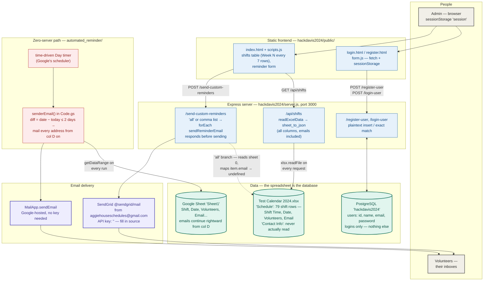
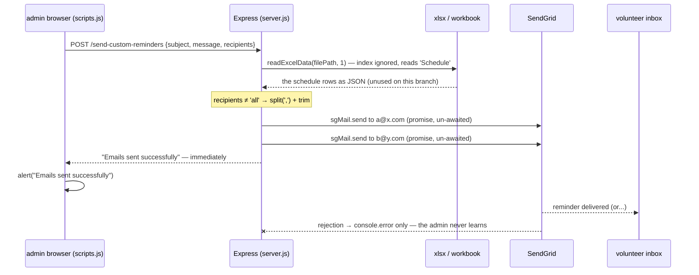

# Aggie Reminder — system design

> How a shift on a spreadsheet becomes an email in a volunteer's inbox — two ways.
>
> An admin opens a dashboard served by a **one-file Express server**, which
> re-reads an Excel workbook on every request — the spreadsheet *is* the
> database — and fires reminders through **SendGrid**, while PostgreSQL's only
> job is remembering who can log in. In parallel, a **Google Apps Script**
> pasted into the same roster's Google Sheet wakes up once a day on a
> time-driven trigger, finds every shift at most two days out, and mails every
> address on the row through **MailApp** — no server, no keys, no process to
> keep alive. The two paths share a row shape, not a line of code.

This document is the developer-facing map of the whole system — every
component and how data moves between them. The companion
[README](README.md) covers the per-layer detail, setup, and the endpoint
reference.

---

## End-to-end flowchart



**Legend** — ⬜ people · 🟦 frontend + Express server · 🟩 data stores ·
🟪 email delivery · 🟥 Google-side automation ·
◌ dashed = the broken `'all'` roster path (wrong sheet, wrong key case).

---

## How to read it: the three ideas that matter

1. **The spreadsheet is the database.** There is no import step, no ORM model
   of a shift, no sync job. `/api/shifts` calls `xlsx.readFile` on the
   workbook *per request* and returns `sheet_to_json` of the first sheet
   verbatim; the Apps Script calls `getDataRange().getValues()` on its Google
   Sheet *per trigger run*. Whoever edits the spreadsheet has, by definition,
   updated production — which is precisely right for a volunteer org whose
   actual scheduling tool *is* the spreadsheet. PostgreSQL is deliberately
   demoted to one table (`users`) that exists only so the dashboard can have
   a login page; no schedule fact ever touches it.

2. **Two delivery paths that share a data shape, not code.** The Express path
   is interactive — an admin composes a subject and message and picks
   recipients — but it needs a laptop running `nodemon`, a local Postgres,
   and a SendGrid key edited into source. The Apps Script path is the
   inverse: fully automatic, zero infrastructure (Google hosts the sheet, the
   cron, and the mailer), but it sends one fixed message shape. The only
   thing they agree on is the row layout — *Shift | Date | Volunteers |
   Email…* — visible in both committed workbooks. The automation path is the
   one that survives the demo: it keeps firing daily with nobody's laptop
   open.

3. **Trust and delivery are both fire-and-forget.** Auth is a client-side
   `sessionStorage` gate (`home.js` redirects to `/login`); no server
   endpoint checks a session, so the schedule — volunteer emails included —
   and the send-email endpoint are open to anyone who can reach port 3000.
   Likewise, `/send-custom-reminders` responds `'Emails sent successfully'`
   synchronously while the un-awaited SendGrid promises resolve or fail into
   `console.log`/`console.error`. The system's only failure signal, on both
   paths, is a log nobody is required to be watching. Hackathon-appropriate;
   documented here so nobody mistakes it for more.

---

## Deep dive 1 — one custom reminder, end to end

The admin fills the dashboard form with a subject, a message, and
`"a@x.com, b@y.com"` (the comma-separated path — the one that works), and
clicks *Send Reminders*:



Things worth noticing:

- **The workbook is read even when it isn't needed.** The contact-sheet read
  happens before the branch, so every custom send pays one full
  `xlsx.readFile` of the whole workbook — harmless at this scale, and a
  measure of how cheap the spreadsheet-as-database bet is.
- **The `'all'` branch fails silently, twice.** Had the admin typed `all`:
  `readExcelData(filePath, 1)` ignores its second argument (the function
  signature is `readExcelData(filePath)`) and returns the `Schedule` sheet,
  not `Contact Info`; then `.map(item => item.email)` misses the capital-`E`
  `Email` header, yielding `[undefined, ...]`. SendGrid rejects each send,
  each rejection is logged, and the browser still alerts success.
- **The response races the delivery** — by design of the `forEach`, success
  is announced at the moment the loop *finishes queueing*, not when SendGrid
  answers.

## Deep dive 2 — anatomy of a roster row, and the daily trigger

Both paths consume the same row. Here is what the Apps Script actually does
with one, verified against [automated_reminder.txt](automated_reminder/automated_reminder.txt)
and the committed [Formatted Sheet.xlsx](automated_reminder/Formatted%20Sheet.xlsx):

```text
   Google Sheet 'Sheet1' — getDataRange().getValues(), header sliced off
   ┌────────────┬───────────┬───────────────────┬──────────────────────┬──────────────────┐
   │ A: Shift   │ B: Date   │ C: Volunteers     │ D: Email             │ E: Email…        │
   │ event[0]   │ event[1]  │ event[2]          │ ◄─── event.slice(3) harvests D onward ──►│
   ├────────────┼───────────┼───────────────────┼──────────────────────┼──────────────────┤
   │ 7PM-8:30AM │ (date)    │ Hieu Hoang, Basti │ hiehoang@ucdavis.edu │ ender21803@...   │
   └────────────┴───────────┴───────────────────┴──────────────────────┴──────────────────┘

   daily, at the trigger hour:
     today  = new Date(), clamped to midnight
     date   = new Date(event[1]), clamped to midnight
     diff   = Math.round((date − today) / 86,400,000)      // whole days

     diff:   …  -2   -1    0   +1   +2  │ +3  +4 …
             ─────── sends ─────────────│─── skips ───
             ▲ no lower bound: a past shift matches
               again on every future run, forever

     for each cell D, E, … (empty or not):
         MailApp.sendEmail(email, "AggieHouse Reminder",
             "This is a reminder for you upcomming volunteer on " + event[1])
```

Two structural notes:

- **The window is one-sided.** `diff <= 2` was written as "two days before
  the shift", but nothing stops matching once the date passes — every stale
  row re-fires daily until someone deletes it from the sheet.
- **Row padding is a landmine.** `getValues()` pads every row to the widest
  row's length with empty strings, so a row with one email in a two-email
  sheet hands `''` to `MailApp.sendEmail`, which throws on an invalid
  recipient and aborts the remainder of that run's loop. The committed sheet
  has exactly this shape (column E is blank on most rows).

On the Express side the same layout arrives as `sheet_to_json` objects keyed
by the header row — `{"Shift Time", "Date", "Volunteers", "Email"}` — with
dates as raw Excel serials, which is why
[scripts.js](hackdavis2024/public/js/scripts.js) converts with
`(serial − (25567 + 2)) × 86,400,000` (the 25,569-day Excel→Unix epoch
offset) before rendering, and re-adds the timezone offset so the date doesn't
slip a day west of UTC.

---

## Component inventory

| Component | Layer | Provenance | Where |
|---|---|---|---|
| Express server — routes, Knex/Postgres, xlsx ingestion, SendGrid | Backend | ✅ project-authored | [hackdavis2024/server.js](hackdavis2024/server.js) |
| Dashboard — shifts table + reminder form | Frontend | ✅ project-authored | [public/index.html](hackdavis2024/public/index.html), [js/scripts.js](hackdavis2024/public/js/scripts.js) |
| Login / register — fetch + sessionStorage session | Frontend | ✅ project-authored | [login.html](hackdavis2024/public/login.html), [register.html](hackdavis2024/public/register.html), [js/form.js](hackdavis2024/public/js/form.js) |
| Client-side auth gate (+ orphaned greeting/logout code) | Frontend | ✅ project-authored | [js/home.js](hackdavis2024/public/js/home.js), [css/home.css](hackdavis2024/public/css/home.css) |
| Time-driven reminder script | Automation | ✅ project-authored | [automated_reminder/automated_reminder.txt](automated_reminder/automated_reminder.txt) |
| Sample workbooks — the data contract | Data | project sample data | [Test Calendar 2024.xlsx](hackdavis2024/Test%20Calendar%202024.xlsx), [Formatted Sheet.xlsx](automated_reminder/Formatted%20Sheet.xlsx) |
| Run guides | Docs | ✅ project-authored | [Procedures.md](Procedures.md), [README!.txt](automated_reminder/README!.txt) |
| express / knex / pg / xlsx / @sendgrid/mail / cors / body-parser / nodemon | Dependencies | third-party npm | [package.json](hackdavis2024/package.json) |
| `cor`, `expres`, `express.js` | — | ⬜ stowaways — typo'd installs, imported nowhere | [package.json](hackdavis2024/package.json) |
| Chrome debug config | — | ⬜ leftover — targets :8080, server runs on :3000 | [.vscode/launch.json](hackdavis2024/.vscode/launch.json) |

---

## The numbers that matter

| Value | What it is |
|---|---|
| 3000 | the Express port (`app.listen(3000)`) |
| 8080 | the port the committed Chrome debug config expects — nothing listens there |
| `''` | the SendGrid API key as committed — filled in by editing `server.js` |
| `'2002'` | the hardcoded Postgres password (`postgres@127.0.0.1`, db `hackdavis2024`) |
| ≤ 2 days | the Apps Script send window — one-sided, so past shifts re-fire daily |
| 25567 + 2 | the Excel→Unix epoch offset (in days) used by the dashboard's date conversion |
| 86,400,000 | milliseconds per day, in both the dashboard and Apps Script date math |
| 7 | schedule rows per "Week N" separator in the shifts table |
| 79 | populated shift rows in the sample `Schedule` sheet (used range padded to row 278) |
| 2 | sheets in `Test Calendar 2024.xlsx` — the code can only ever read the first |
| column D | where `event.slice(3)` starts harvesting reminder addresses on each row |
| 1 | database tables (`users`) — the entire footprint of PostgreSQL in this system |
| i × 100 ms | the staggered fade-in of each login/register form field |
| 5 s | how long the red alert box shows before sliding away |
| 0 | password hashing rounds — plaintext in, plaintext compared |
| 0 | server-side session checks after login — the gate is `sessionStorage` only |

---

## Verification status

There are **no automated tests** — no test runner, no test files, on either
path. The system was validated the hackathon way:

| Check | How |
|---|---|
| Server boots and serves | run per [Procedures.md](Procedures.md) — `npm start`, watch for `listening on port 3000......`, open `localhost:3000` |
| Excel ingestion | `/api/shifts` logs the file path and the parsed rows to the console on every hit; `curl http://localhost:3000/api/shifts` |
| Auth round-trip | register → auto-login → dashboard redirect, driven by hand through the forms |
| Email delivery | per-recipient `console.log('Email sent successfully to', …)` / `console.error` from the SendGrid promises |
| Apps Script | manual run from the editor ("run the whole code" per [README!.txt](automated_reminder/README!.txt)); its only instrumentation is `Logger.log(emails.length)` |

The bugs documented here (the `'all'` branch, the one-sided date window, the
hanging error paths) are exactly the kind this workflow can't catch: they sit
on branches a demo never exercises.

---

## Design trade-offs & sharp edges

- **Spreadsheet-as-database over a real schema** — zero import friction and
  the org keeps its native tool, but every request re-parses the workbook,
  the schema is whatever the header row says (`Email` vs `email` cost the
  `'all'` feature), and there's no way to validate a row before it becomes
  production data.
- **Two paths over one** — redundancy by parallel construction: the Express
  app demos well, the Apps Script actually runs unattended. The cost is that
  fixes don't transfer; the date-window bug lives only in the script, the
  roster bugs only in the server.
- **Client-side sessions over server auth** — `sessionStorage` + redirect is
  a UI convenience, not a boundary. Every endpoint, including the one that
  sends email and the one that returns volunteer emails, is unauthenticated.
- **Fire-and-forget email over delivery tracking** — the endpoint's success
  message is decoupled from reality; failures are console-only. There is no
  batching, no retry logic, and no per-recipient status.
- **Edit-the-source configuration** — API key, DB credentials, and an
  absolute Windows path (`C:\Users\minhk\...`) are constants in
  `server.js`; there is no `.env`, so setup means editing three places in
  one file (and the committed defaults leak a dev machine's layout).
- **Unhandled rejection cliffs** — `/login-user` has no `.catch`;
  `/register-user`'s catch reads `err.detail` unconditionally. Any DB-level
  failure leaves the HTTP request hanging with no response.
- **Dead code in the shipped frontend** — a missing `app.js` 404s on every
  dashboard load, and `home.js` throws a `TypeError` reaching for `.greeting`
  / `.logout` elements that only exist in the orphaned `home.css` design; the
  login gate survives because it registers before the throw.

---

## Provenance

A HackDavis 2024 hackathon project — the server directory, npm package, and
Postgres database are all named `hackdavis2024`, and the Apps Script sample
sheet is dated spring 2024 (`Test Calendar 2024.xlsx`'s schedule rows are
mostly spring/summer 2023). Built for **Aggie House** volunteer scheduling (logo,
`aggiehouseschedules@gmail.com` sender, `AggieHouse Reminder` subject). All
application code — [server.js](hackdavis2024/server.js), the static frontend
under [public/](hackdavis2024/public), and the Apps Script in
[automated_reminder/](automated_reminder) — is project-authored; third-party
code enters only through npm (`express`, `knex`, `pg`, `xlsx`,
`@sendgrid/mail`, `cors`, `body-parser`, `nodemon`). No authors are named in
the code or the original README; the observable traces are the
`C:\Users\minhk` path in `server.js` and the names in the sample rosters.
The team's original run guides — [Procedures.md](Procedures.md) and
[README!.txt](automated_reminder/README!.txt) — are preserved unmodified.
